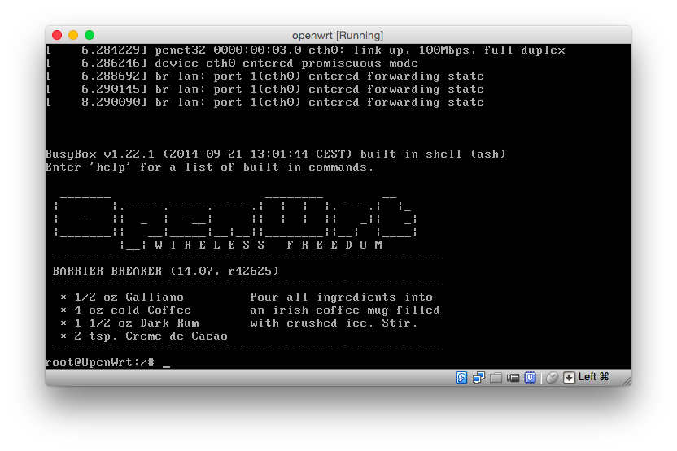

+++
title = "OpenWRT in Virtualbox"
aliases = ["2014/11/23/openwrt-in-virtualbox/"]
layout = "blog/single.html"
[taxonomies]
tags = [
  "Tutorials",
  "OpenWRT",
]
+++

For my CSC 467 project I'm studying the configuration and performance of various QoS parameters in OpenWRT.

The plan is to set up an OpenWRT router in [VirtualBox](https://www.virtualbox.org/) and orcestrate some [Vagrant](http://vagrantup.com/) boxes to create a VM network.

<!-- more -->

## Configuration

Lets configure some environment variables we'll use throughout, once you close your shell these will disappear, so you might need to reinitialize them later.

    NAME="openwrt"
    URL="https://downloads.openwrt.org/barrier_breaker/14.07/x86/generic/openwrt-x86-generic-combined-ext4.img.gz"
    VDI="./openwrt.14.07.vdi"
    VMNAME="openwrt"
    SIZE='512000000'

## Getting a VDI

Pull the image, unzip it, and make a VDI out of it for VirtualBox.

    curl $URL \
    | gunzip \
    | VBoxManage convertfromraw --format VDI stdin $VDI $SIZE

## Setup the VM

Configure a VM with some modest settings for the router. We can add adapters and other storage devices later. This is a 3 port router.

    VBoxManage createvm --name $VMNAME --register && \
    VBoxManage modifyvm $VMNAME \
        --description "A VM to build an OpenWRT Vagrant box." \
        --ostype "Linux26" \
        --memory "512" \
        --cpus "1" \
        --nic1 "intnet" \
        --intnet1 "port1" \
        --nic2 "intnet" \
        --intnet2 "port2" \
        --nic3 "intnet" \
        --intnet3 "port3" \
        --nic4 "nat" \
        --natpf4 "ssh,tcp,,2222,,22" \
        --natpf4 "luci,tcp,,8080,,80" \
        --uart1 "0x3F8" "4" \
        --uartmode1 "disconnected" && \
    VBoxManage storagectl $VMNAME \
        --name "SATA Controller" \
        --add "sata" \
        --portcount "4" \
        --hostiocache "on" \
        --bootable "on" && \
    VBoxManage storageattach $VMNAME \
        --storagectl "SATA Controller" \
        --port "1" \
        --type "hdd" \
        --nonrotational "on" \
        --medium $VDI

That's it! Now to fire up the VM:

    VBoxManage startvm openwrt --type "gui"

Next, it's time to settle in and get comfortable. The boot output will not show you command prompt until you manually focus the window and tap return, then you should see a prompt.

## WAN

You'll notice from a quick `ping hoverbear.org` that you don't have a network connection working, even though we set up a NAT connection.

In the OpenWRT VM, add the following to `/etc/config/network`:

    config interface 'wan'
        option ifname   'eth3'
        option proto    'dhcp'

Then restart the networking service:

    /etc/init.d/network restart

Now you should be able to `ping hoverbear.org`

## Pulling Repos

Before doing much more, you may wish to fetch the repository listing:

    opkg update

## Password
You may want to set up a password on the account, or put set up an SSH key for login. You may also want to use a non-root user.

    passwd

## SSH

OpenWRT uses Dropbear as an SSH server. *(In my totally unbiased opinion, that is an awesome name)*

Lets set it up so we don't have to keep working in the VirtualBox GUI. Having a native terminal is much more comfortable.

By default, Dropbear is **already** installed, but if you don't have it for some reason, you can install it with:

	  opkg install dropbear

Then check `/etc/config/dropbear`. By default, PasswordAuth and RootPasswordAuth are both on and it runs on port 22. For our Virtual Machine testing purposes, this is fine, it will be port-forwarded on port 2222 of our host machine. On a system facing the world (I.E. not behind a NAT and router etc) this would be considered very, very bad practice.

According to [the Dropbear WRT documentation](http://wiki.openwrt.org/doc/uci/dropbear), it is already enabled. If you change the configuration make sure to restart it.

    /etc/init.d/dropbear restart

However if you attempt to `ssh root@localhost -p 2222` you'll see a something along the lines of `ssh_exchange_identification: read: Connection reset by peer`. That's because the firewall is blocking it.

Now in `/etc/config/firewall` we can add a rule to fix this:

    # ... Other Rules ...

    # Allow SSH on wan
    config rule
            option src              wan
            option proto            tcp
            option dest_port        22
            option target           ACCEPT

Then restart the firewall:

    /etc/init.d/firewall restart

Now you should be able to run `ssh root@localhost -2222` on the host machine and connect.

## Going Headless

Make sure you've set up SSH (and logged in!) first before trying this.

You can stop the VM and start it again in a headless form.

Stop the VM:

    VBoxManage controlvm $VMNAME poweroff

Start it headless:

    VBoxManage startvm $VMNAME --type headless

## Guest Additions

Unfortunately it seems OpenWRT does not provide simple workflow for VirtualBox Guest Additions. Please let me know if you find a way of getting this working.

## LAN

To set up the other adapters, remove the `lan` section from the `/etc/config/network` file and replace it with:

    config interface 'lan1'
        option ifname 'eth0'
        option proto 'static'
        option ipaddr '192.168.1.1'
        option netmask '255.255.255.0'
        option ip6assign '60'

    config interface 'lan2'
        option ifname 'eth1'
        option proto 'static'
        option ipaddr '192.168.2.1'
        option netmask '255.255.255.0'
        option ip6assign '60'

    config interface 'lan3'
        option ifname 'eth2'
        option proto 'static'
        option ipaddr '192.168.3.1'
        option netmask '255.255.255.0'
        option ip6assign '60'

Then restart the network:

    /etc/init.d/network reload

## DHCP

Since we removed the `lan` interface above, you'll need to reconfigure the DHCP daemon. Remove the `lan` block from `/etc/config/dhcp` and replace it with this:

    config dhcp 'lan1'
        option interface 'lan1'
        option start '100'
        option limit '150'
        option leasetime '12h'
        option dhcpv6 'server'
        option ra 'server'
        list 'dhcp_option' '3,192.168.1.1'

    config dhcp 'lan2'
        option interface 'lan2'
        option start '100'
        option limit '150'
        option leasetime '12h'
        option dhcpv6 'server'
        option ra 'server'
        list 'dhcp_option' '3,192.168.2.1'

    config dhcp 'lan3'
        option interface 'lan3'
        option start '100'
        option limit '150'
        option leasetime '12h'
        option dhcpv6 'server'
        option ra 'server'
        list 'dhcp_option' '3,192.168.3.1'

Then restart the `dhcp` and `dnsmasq` services.

    /etc/init.d/odhcpd reload
    /etc/init.d/dnsmasq reload

## Firewall

This new configuration won't work without modifying the firewall, too. Change the `lan` zone in `/etc/config/firewall` to:

    config zone
        option name             lan
        list   network          'lan1'
        list   network          'lan2'
        list   network          'lan3'
        option input            ACCEPT
        option output           ACCEPT
        option forward          ACCEPT

Then restart the firewall.

		/etc/init.d/firewall reload

## Making Clients

We can create other VMs which attach to our new router.

I'll be writing later about how to get these subordinates, (ahem, *network clients*) working together with the router.

[See next post.](http://www.hoverbear.org/2014/12/04/vagrant-clients-for-openwrt-vms/)
